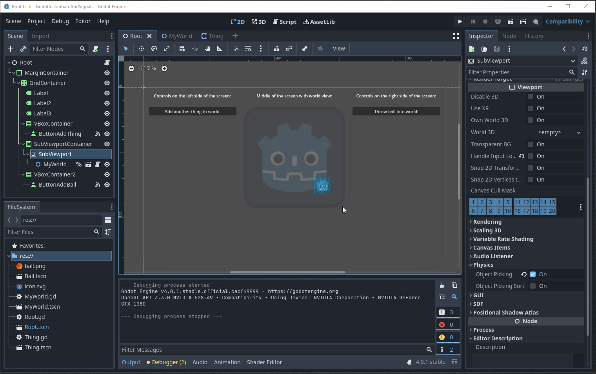

# Sample for Godot SubViewport with Input Events

Demonstrates how you can have `pickable` bodies inside a `SubViewport` based world with Godot 4.x.
Even if those components are created with `instantiate()`.

Disclaimer: this was created while _learning_ Godot programming.
I'm a web developer by trade, not a game developer.
Take this sample with a grain of salt.

## About the sample

Running this sample allows you to:

- See `input_event` at work for the Static Body's (those with the Godot icon sprite) by clicking them
- Add fresh instances of that component through code by pushing the button, and see they're also connected
- Drop some `RigidBody2D` balls on top of it all to ensure physics is working for the stuff inside the SubViewport

And that's about it!

## Demo

Here's what things operate like when running:

